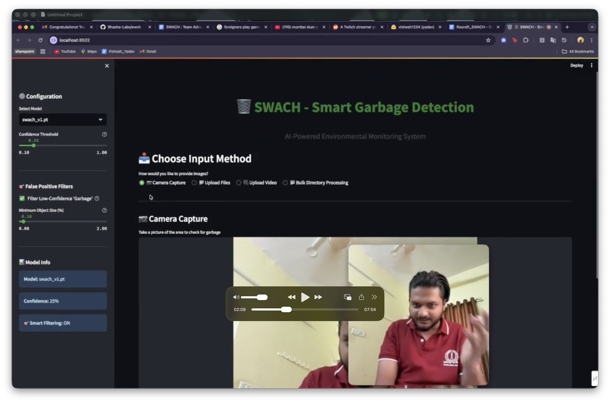
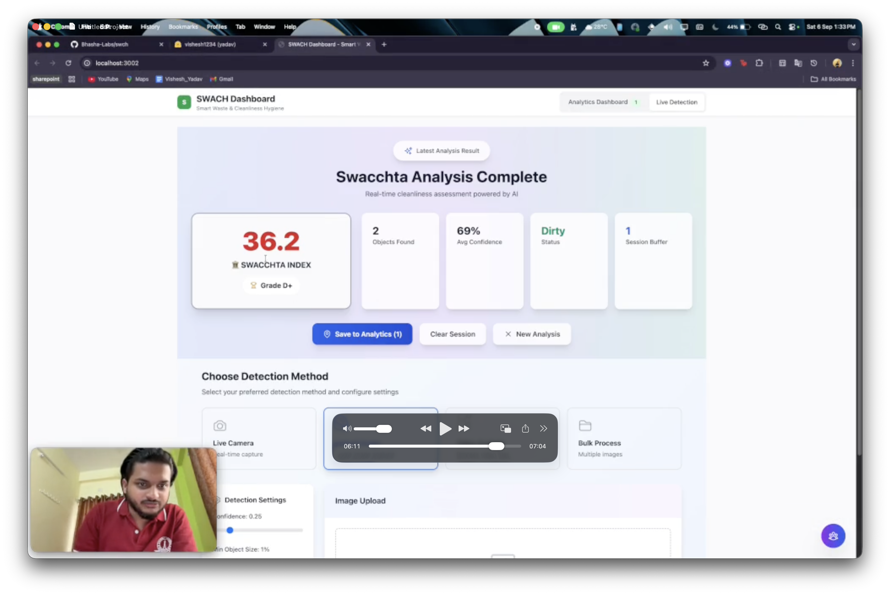

<div align="center">
    
    <h1>SWACH - Smart AI Garbage Detection System</h1>
</div>

Repository Link: https://github.com/Bhasha-Labs/swach.git

**Team ID:** TH11546

## 1. Overview

SWACH is an intelligent garbage detection system that uses computer vision and machine learning to assess environmental cleanliness through a quantifiable **Swacchta Index (SI)**. The application provides real-time analysis of images and videos to detect various types of garbage and generate standardized cleanliness scores from 0-100. It combines YOLO-based object detection with sophisticated mathematical algorithms to create a comprehensive environmental monitoring solution suitable for municipalities, environmental agencies, and urban planners.

## 2. Problem & Solution

### Problem Statement:
Urban areas worldwide struggle with garbage management and environmental monitoring. Traditional methods rely on manual inspection, which is:
- Time-consuming and labor-intensive
- Inconsistent in assessment criteria
- Difficult to scale across large areas
- Lacks standardized measurement systems

### Solution:
SWACH addresses these challenges by providing:
- Automated, consistent garbage detection using computer vision
- Standardized cleanliness scoring system (Swacchta Index 0-100)
- Scalable analysis for municipal areas
- Data-driven environmental monitoring with real-time processing
- Interactive dashboard for comprehensive area management

## 3. Logic & Workflow

### Data Collection:
- Real-time camera-based live detection
- Image upload and video processing capabilities
- Bulk image analysis for large-scale assessment
- Geographic integration with location tracking and coordinate management

### Processing:
- YOLO v8 object detection for garbage identification
- Mathematical algorithm for Swacchta Index calculation:
  ```
  Swacchta Index (SI) = max(0, 100 - Total_Impact_Score)
  ```
- Total_Impact_Score considers:
  - Base impact from detected objects (confidence × severity × size)
  - Coverage penalty based on area covered by garbage
  - Density penalty for object concentration
  - Large object penalties for significant visual pollution
  - Additional penalties for pollution variety and visual density

>to know how *Total_Impact_Score* is calculated, please refer to the [Logic_Behind_SI](https://github.com/Bhasha-Labs/swach/blob/main/garbage_detection_colab/Logic_Behind_SI.md)

### Output:
- Standardized cleanliness scores (0-100) with grading scale:
  - 95-100: A+ (Excellent - Pristine)
  - 85-94: A (Very Good - Clean)
  - 75-84: B+ (Good - Mostly Clean)
  - 65-74: B (Fair - Some Issues)
  - 55-64: C+ (Moderate - Noticeable Litter)
  - 45-54: C (Poor - Significant Garbage)
  - 35-44: D+ (Bad - Heavy Pollution)
  - 25-34: D (Very Bad - Severe Issues)
  - 15-24: F+ (Critical - Environmental Hazard)
  - 0-14: F (Catastrophic - Immediate Action Required)

### User Side:
- Real-time garbage detection with instant analysis
- Multi-format support (images, videos, bulk processing)
- Interactive web interface with location tracking
- Session management for different areas
- Professional reporting interface

### Admin Side:
- Advanced configuration with customizable confidence thresholds
- Object size filters and processing options
- Geographic data collection and management
- Comprehensive dashboard for area monitoring
- Data analytics and reporting capabilities

## 4. Tech Stack

- **Frontend**: Next.js with TypeScript (Web Dashboard)
- **Backend**: Python with Streamlit (Core Application)
- **Computer Vision**: YOLO v8 (Object Detection)
- **Data Processing**: Custom algorithms (Swacchta Index calculation)
- **Geographic Integration**: Location tracking and coordinate management
- **Web Framework**: Streamlit (Application Interface)

## 5. Future Scope

The prototype can be scaled with advanced AI features including multi-class garbage classification, predictive analytics for waste management, mobile app integration for field workers, real-time IoT sensor integration, and multi-user support for wider municipal adoption. Additional features could include automated reporting systems, integration with municipal databases, and machine learning models for predictive cleanliness assessment.

---

## How to Run the Application

### Streamlit Application (Core Detection)

1. Clone the repository:
```bash
git https://github.com/Bhasha-Labs/swach.git
cd swach-main
```

2. Install dependencies:
```bash
pip install -r requirements.txt
```

3. Navigate to the application directory:
```bash
cd garbage_detection_colab
```

4. Run the Streamlit application:
```bash
streamlit run streamlit_app.py
```

The application will be available at `http://localhost:8501` in your web browser.

>Model Inference will look like this / scroll down to see dashboard instead:


### Interactive Dashboard

1. Navigate to the dashboard directory:
```bash
cd swach-dashboard
```

2. Install Next.js Dependencies:
```bash
npm install
```

3. Run the Next.js application:
```bash
npm run dev
```

The application will be available at `http://localhost:3000` in your web browser.

>Dashboard will look like this with inbuilt tutorial:


## Public Code Repository
**GitHub Repository:** https://github.com/Bhasha-Labs/swach.git

> For detailed algorithm explanation, please refer to the [Logic_Behind_SI](https://github.com/Bhasha-Labs/swach/blob/main/garbage_detection_colab/Logic_Behind_SI.md)
